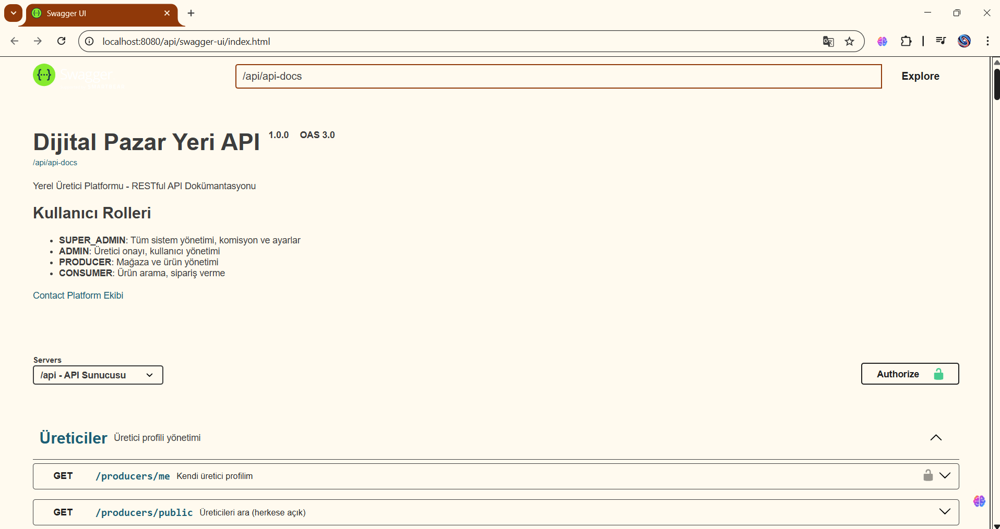

# Digital Marketplace Backend

A **Spring Boot based marketplace backend** where local producers (farmers, artisans, homemade product sellers) can sell products directly to consumers.

This project demonstrates a **multi-role e-commerce backend architecture** including authentication, product management, order processing, payments, reviews, and administrative reporting.

---

# Architecture

The backend follows a **layered architecture** to keep the system modular and maintainable.

Client applications interact with REST controllers, which delegate business logic to services and persistence to repositories.

```
Client (Web / Mobile)
        │
        ▼
REST Controllers
        │
        ▼
Service Layer
(Business Logic)
        │
        ▼
Repository Layer
(Spring Data JPA)
        │
        ▼
PostgreSQL Database
```

Security is handled through **Spring Security with JWT authentication**.

---

# Tech Stack

| Layer             | Technology                  |
| ----------------- | --------------------------- |
| Backend Framework | Spring Boot 3               |
| Language          | Java 17                     |
| Security          | Spring Security + JWT       |
| Database          | PostgreSQL                  |
| ORM               | Spring Data JPA (Hibernate) |
| Migration         | Flyway                      |
| API Documentation | Swagger / OpenAPI           |
| Build Tool        | Maven                       |
| Containerization  | Docker                      |

---

# Core Features

## Authentication & Security

* JWT based authentication
* Refresh token mechanism
* Password reset via email
* Role based authorization

## Marketplace System

* Product management
* Category hierarchy
* Product search and filtering
* Product image support

## Order Management

* Order creation
* Order status workflow
* Producer order dashboard
* Order cancellation

## Payment System

* Payment processing
* Payment tracking
* Refund functionality

## Reviews & Ratings

* Product reviews
* Admin moderation system

## Favorites

* Save favorite products
* Favorite status check

## Producer System

* Producer registration request
* Admin approval / rejection
* Commission configuration

## Reporting System

* Sales reports
* Commission reports
* Top selling products
* Producer performance reports

## Admin Panel

* Dashboard statistics
* User management
* Producer management
* Platform configuration

---

# User Roles

| Role        | Description                                    |
| ----------- | ---------------------------------------------- |
| SUPER_ADMIN | Full system control and platform configuration |
| ADMIN       | User and producer management                   |
| PRODUCER    | Store management and order tracking            |
| CONSUMER    | Product browsing and purchasing                |

---

# Database ER Diagram (Conceptual)

```
Users
 ├── ProducerProfiles
 ├── ConsumerProfiles
 ├── Addresses

Products
 ├── ProductImages
 ├── Reviews
 ├── Favorites

Orders
 ├── OrderItems
 ├── Payments

Categories
 └── Products

Cities
 └── Districts
```

Main tables:

```
users
producer_profiles
consumer_profiles
products
product_images
categories
orders
order_items
payments
reviews
favorites
commission_transactions
platform_settings
password_reset_tokens
refresh_tokens
cities
districts
addresses
```

---

# API Documentation

After starting the application:

Swagger UI

```
http://localhost:8080/api/swagger-ui.html
```

OpenAPI JSON

```
http://localhost:8080/api/api-docs
```

Swagger provides interactive documentation for all API endpoints.

---

## API Preview

Swagger UI Interface



# Installation

## Requirements

* Java 17+
* Maven 3.8+
* PostgreSQL 15+

---

## 1 Create Database

```sql
CREATE DATABASE pazaryeri_db;

CREATE USER pazaryeri_user WITH PASSWORD 'your_password';

GRANT ALL PRIVILEGES ON DATABASE pazaryeri_db TO pazaryeri_user;
```

---

## 2 Environment Variables

```bash
export DB_USERNAME=pazaryeri_user
export DB_PASSWORD=your_password
export JWT_SECRET=your_256_bit_secret_key
export MAIL_USERNAME=your_email@gmail.com
export MAIL_PASSWORD=your_app_password
```

---

## 3 Run Application

```
mvn clean install
mvn spring-boot:run
```

---

# Run With Docker

```
docker-compose up -d
```

---

# Project Structure

```
src/main/java/com/pazaryeri

config/         Security & OpenAPI configuration
controller/     REST controllers
dto/            Request / response models
entity/         JPA entities
enums/          Application enums
exception/      Global exception handling
repository/     Spring Data repositories
security/       JWT authentication logic
service/        Business logic layer
service/impl/   Service implementations
```

---

# Default Admin Account

```
Email: admin@pazaryeri.com
Password: Admin123!
```

Change these credentials before production use.

---

---

# Türkçe

## Dijital Pazar Yeri Backend

Bu proje, **yerel üreticilerin (çiftçiler, zanaatkarlar, ev yapımı ürün satıcıları)** ürünlerini doğrudan tüketicilere satabildiği bir **dijital pazar yeri platformunun backend API'sidir.**

Spring Boot kullanılarak geliştirilmiş olup aşağıdaki sistemleri içerir:

* JWT kimlik doğrulama
* Rol bazlı yetkilendirme
* Ürün yönetimi
* Sipariş sistemi
* Ödeme sistemi
* Yorum sistemi
* Favori ürünler
* Admin paneli
* Raporlama sistemi

---

## Kullanıcı Rolleri

| Rol         | Açıklama                                 |
| ----------- | ---------------------------------------- |
| SUPER_ADMIN | Platform ayarları ve tam sistem kontrolü |
| ADMIN       | Kullanıcı ve üretici yönetimi            |
| PRODUCER    | Ürün ekleme ve sipariş yönetimi          |
| CONSUMER    | Ürün arama ve sipariş verme              |

---

## Kurulum

### Gereksinimler

* Java 17+
* Maven
* PostgreSQL

---

### Veritabanı oluşturma

```sql
CREATE DATABASE pazaryeri_db;
```

---

### Uygulamayı çalıştırma

```
mvn clean install
mvn spring-boot:run
```

---

### Docker ile çalıştırma

```
docker-compose up -d
```

---

## API Dokümantasyonu

Swagger arayüzüne şu adresten erişilebilir:

```
http://localhost:8080/api/swagger-ui.html
```
